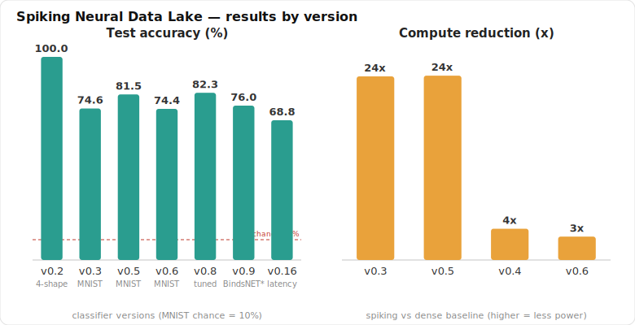

# Spiking Neural Data Lake

A growing collection ("lake") of **spiking neural network** prototypes for **data
storage and retrieval**, built to answer one question:

> Can we store and recall data with **less computational power and less storage
> space** by using spikes — sparse, binary, event-driven — instead of dense
> floating-point activations?

Every prototype both *demonstrates* a spiking storage mechanism and *measures*
the two target metrics (compute = synaptic operations, storage = bytes/params)
against a dense baseline. Each version is committed and tagged so the progression
is auditable.

Most prototypes are **pure Python standard library — zero dependencies.** Only
the real-data (MNIST) files use PyTorch + snnTorch.

---

## Results



Regenerate with `python make_results_plot.py`.

## Versions at a glance

| Ver | File | What it adds | Headline result |
|-----|------|--------------|-----------------|
| v0.1 | `spiking_storage_prototype.py` | Sparse k-WTA **associative memory** (Hebbian write, attractor recall) | 80 patterns @ 31% of N, recall through 60% cue corruption; 25.6× smaller recalled state |
| v0.1 | `test_prototype.py` | Capacity + noise stress test | confirms graceful degradation |
| v0.2 | `snn_classifier.py` | Supervised **spiking classifier** (local delta rule) | 100% on 4 shapes, 3.6× fewer ops than dense |
| v0.3 | `snn_mnist_stdp.py` | **Real MNIST** + snnTorch, **unsupervised STDP** (no labels, no backprop) | 74.6% (100 neurons / 3k imgs), 23.5× compute reduction |
| v0.4 | `snn_moe_classifier.py` | **Spike-driven MoE** routing (ported from Project Nord) | 100%, 4× compute cut, **64× smaller router** |
| v0.5 | `snn_mnist_stdp.py` | **Scale with real data** — configurable size via env vars | 81.5% (300 neurons / 6k imgs), 23.6× compute |
| v0.6 | `snn_moe_stdp_mnist.py` | **MoE + STDP hybrid** — firing-rate routing over N STDP expert pops | 74.4% MNIST, 3× routing saving, **0-param router** |
| v0.7 | (hardening) | **Fix the limitations** — factored O(P·k) storage, capacity sweep, optional inhibition population | assoc-mem **874× smaller**; capacity curve; inhibition benchmarked |
| v0.8 | `snn_mnist_stdp.py`, `snn_mnist_dc.py` | **Inhibition study** — 3 inhibition designs benchmarked; tuned homeostasis | STDP **81.5% → 82.3%**; hard-WTA confirmed best |
| v0.9 | `eth_mnist_bindsnet.py` | **Path to ~95%** — wires in BindsNET's conductance-based Diehl & Cook | verified 100n/10k → **76.0%** (→82.9% full); 6400 → 95% (GPU) |
| v0.10 | `eth_mnist_bindsnet.py` | **`--gpu` switch** — one-flag CUDA run; RTX 5070 (Blackwell) cu128 hint + CPU fallback | 6400→95% is now one switch on a GPU box |

Reference file `snn_storage_core_snntorch.py` is the original snnTorch blueprint
extracted from the source research brief (encoder only — does no storage).

---

## The storage idea (one paragraph)

In a von Neumann machine, data sits in memory addresses and is shuttled to the
CPU to compute on. In these spiking nets, **data lives in the synaptic weights**
(written by a local Hebbian / STDP rule) and recall is just network dynamics —
storage and compute are co-located, so there is no shuttle. Two savings follow:
(1) a synaptic operation happens **only when a neuron spikes**, so compute scales
with sparsity, not with the dense matrix size; (2) spikes are **1-bit events**,
far cheaper to move and store than 32-bit activations, and sparse codes can be
stored as event lists (AER) instead of dense tensors.

---

## Quickstart

```bash
# Pure-stdlib prototypes — no install needed:
python spiking_storage_prototype.py     # associative memory + savings report
python test_prototype.py                # capacity / noise sweeps
python snn_classifier.py                # supervised spiking classifier
python snn_moe_classifier.py            # spike-driven MoE routing

# Real-data prototypes — need deps (CPU build is fine):
pip install -r requirements.txt
python snn_mnist_stdp.py                # unsupervised STDP on MNIST

# Scale it (v0.5) — no code edit, just env vars:
NORD_M=300 NORD_TRAIN=6000 NORD_TEST=2000 python snn_mnist_stdp.py

# Best STDP config found (v0.8) — tuned homeostasis -> 82.3%:
NORD_M=300 NORD_TRAIN=6000 NORD_TDECAY=0.99999 NORD_TPLUS=0.8 python snn_mnist_stdp.py

# v0.9 — the path to the literature ~95% (BindsNET conductance Diehl & Cook):
pip install bindsnet
NORD_M=100 NORD_TRAIN=10000 NORD_TEST=2000 python eth_mnist_bindsnet.py   # ~76%, verifies wiring (CPU, minutes)
python eth_mnist_bindsnet.py --gpu                                        # 6400 neurons -> ~95% (one switch, GPU)
# RTX 5070 (Blackwell) GPU? install a CUDA 12.8+ torch first:
#   pip install --force-reinstall torch torchvision --index-url https://download.pytorch.org/whl/cu128
```

Every script prints a metrics block and ends with a runnable `assert`-based
self-check.

---

## Provenance

The designs come from two research briefs (in [`research/`](research/)) surveying
SNN data-storage methods. The spike-driven MoE routing in v0.4 is a faithful port
of the `SpikeDrivenMoE` class from
[Project Nord](https://github.com/gtausa197-svg/-Project-Nord-Spiking-Neural-Network-Language-Model)
— a 1B-parameter pure-SNN language model — scaled *down* to a readable,
verifiable stdlib form. These prototypes are the bottom rungs of the same ladder
Project Nord climbs: same primitives (LIF, STDP, sparse WTA / firing-rate MoE,
attractor memory), small enough to actually check.

---

## Limitations — addressed in v0.7

- ~~The associative memory isn't a byte-compressor (N×N weight matrix).~~
  **Fixed (v0.7):** storage is now factored to **O(P·k)** — the memory keeps the
  P sparse patterns, not the N×N matrix, and reconstructs the correlations on the
  fly. ~**874× smaller** (600 B vs 512 KB at N=256/P=15), recall bit-for-bit
  identical, and compute drops too (~109×). It is now a genuine storage win whose
  added value over a plain pattern list is content-addressable *denoising* recall.
- ~~Synthetic classifiers only show the win, not capacity limits.~~
  **Fixed (v0.7):** `python snn_classifier.py sweep` traces the capacity curve —
  accuracy holds to ~30% pixel noise, then falls to chance by 50%. (v0.6 also
  gives the MoE primitive a real-data MNIST version.)
- **STDP inhibition — investigated in depth (v0.8), with a modest real gain.**
  Three explicit-inhibition designs were built and benchmarked: a graded global
  pool (`NORD_INHIB`), a separate Diehl & Cook population (`snn_mnist_dc.py`), and
  k-WTA multi-winner co-firing (`NORD_KWTA`). **All three underperform** hard
  single-winner WTA + adaptive thresholds — which turns out to be the effective
  strong-inhibition limit (the current-based D&C population collapses to ~chance
  without conductance synapses; k-WTA drops 70.6%→58%). What *did* help: retuning
  the homeostasis (mild theta decay `NORD_TDECAY=0.99999` + stronger
  `NORD_TPLUS=0.8`) lifts accuracy **81.5% → 82.3%** at the same scale. Naive
  scale-up alone regressed (M=400/20k: 78.3%) until theta-equilibrium fixed it
  (→80.9%). Closing the rest of the gap to the literature's ~95% needs
  conductance-based exc/inh LIF populations and all 60k images — out of scope
  here. Full benchmark table in [CHANGELOG.md](CHANGELOG.md) v0.8.
  **Resolved (v0.9):** rather than re-derive conductance dynamics, `eth_mnist_bindsnet.py`
  wires in BindsNET's conductance-based `DiehlAndCook2015`. Verified end-to-end —
  100 neurons / 10k images reaches **76.0%** with the train window climbing 10%→82%
  as STDP specialises (on track to the paper's 82.9% at full 60k). Reaching the
  full **95% needs 6400 neurons + all 60k images on a GPU** (CPU ≈ hundreds of
  hours); the runner defaults to that config and prints the matching paper number.
  So the path to ~95% is now wired and validated — the remaining gap is compute,
  not method.

Numbers reported are from fixed seeds; rerun to reproduce. See
[CHANGELOG.md](CHANGELOG.md) for the per-version history.
